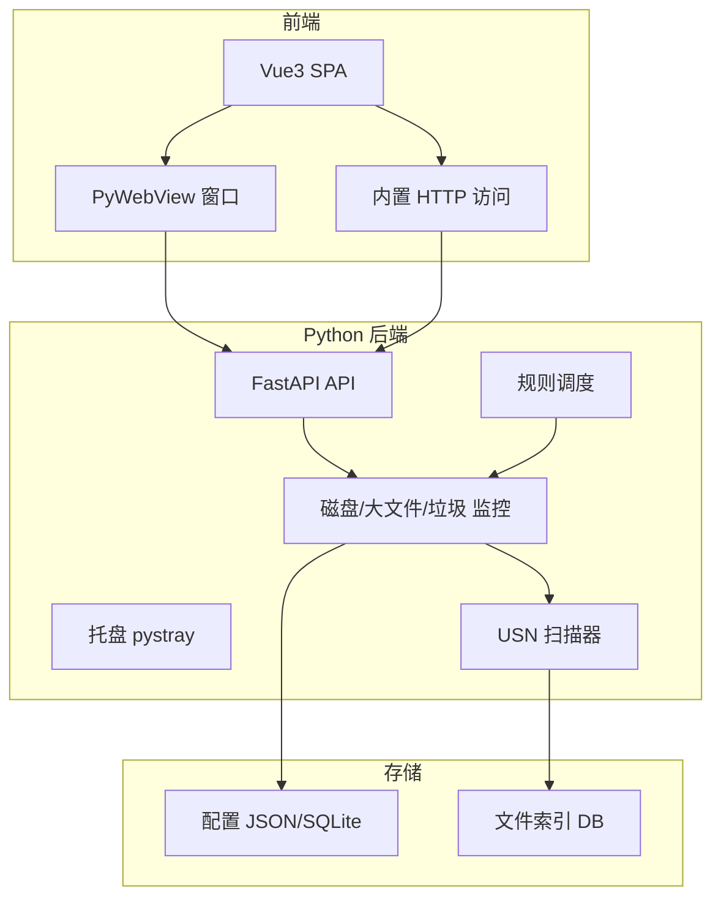

# Windows 文件清理工具实现计划

## 一、技术架构总览




- **后端**：Python 3.10+，FastAPI 提供 REST API 与静态资源服务，pystray 托盘，后台用**少量线程**做监控与扫描，整体**单进程、无多余常驻 worker**，以控制资源占用。
- **前端**：Vue 3 + 构建为 SPA，打包进 exe；通过 PyWebView 作为“双击打开的 GUI”，同一 FastAPI 在本地端口提供“内置网页”访问。
- **快速扫描**：优先使用 NTFS USN Journal（`FSCTL_QUERY_USN_JOURNAL` / `FSCTL_READ_USN_JOURNAL`，pywin32）做**增量**与变更监控，避免频繁全盘遍历；非 NTFS 或首次全量时用 `os.walk` + **分批/限速** + 大文件/扩展名过滤，并采用**低优先级线程**，减少对系统的影响。

---

## 二、目录结构建议

```
windows_cleaner/
├── backend/                    # Python 后端
│   ├── main.py                 # 入口：FastAPI + 托盘 + 可选 PyWebView
│   ├── api/                    # API 路由
│   ├── core/                   # 配置、常量
│   ├── services/               # 扫描、监控、清理、通知
│   ├── utils/                  # USN、磁盘、注册表等
│   └── tests/                  # 单元测试
├── frontend/                   # Vue 3 项目
│   ├── src/
│   └── dist/                   # 构建输出，打包时拷贝到 backend
├── packaging/                  # 打包相关
│   ├── build_exe.py            # PyInstaller 或 脚本
│   └── README_PACK.md          # 打包说明
├── docs/                       # 可选
├── README.md
├── requirements.txt
└── pyproject.toml              # 可选，统一依赖与脚本
```

---

## 三、功能模块与实现要点

### 1. 类似 Everything 的快速扫描（USN + 全量兜底）

- **USN Journal 模块**（如 `backend/utils/usn_journal.py`）  
  - 使用 `win32file.CreateFile` 打开卷（如 `\\.\C:`），`DeviceIoControl` + `FSCTL_QUERY_USN_JOURNAL` / `FSCTL_READ_USN_JOURNAL` 读取变更记录。  
  - 解析 USN 记录得到路径、文件名、时间、原因；仅 NTFS 可用，需管理员或适当权限时再尝试。
- **索引/缓存**：SQLite 存“路径、大小、修改时间、卷”等，**按卷或按需加载**，避免一次性加载全部索引进内存；首次或非 NTFS 时全盘/目录 `os.walk` **分批、可限速、低优先级**构建索引；之后用 USN 增量更新。  
- **大文件扫描**：在索引或全量扫描时按“大小 > 阈值”过滤，并支持按扩展名（如视频）过滤，结果集**限制条数/分页**，供“大文件提醒”与规则清理使用。

**关键依赖**：`pywin32`（win32file、winioctl），可选参考 [USN-Journal-Parser](https://github.com/PoorBillionaire/USN-Journal-Parser) 或微软 [FSCTL_READ_USN_JOURNAL](https://learn.microsoft.com/en-us/windows/win32/api/winioctl/ni-winioctl-fsctl_read_usn_journal) 文档。

### 2. 清理模式


| 模式              | 实现要点                                                                                                                  |
| --------------- | --------------------------------------------------------------------------------------------------------------------- |
| **磁盘空间监控与阈值提醒** | 定期用 `shutil.disk_usage(path)` 获取各盘总/已用/剩余，**程序内部固定合理间隔**（如 15–30 分钟），不与用户配置绑定；与用户配置的“警戒阈值”比较，超阈值则触发通知。该操作轻量，几乎不占 I/O。 |
| **按盘符/目录的清理规则** | 规则配置：目标路径、类型（按扩展名/按大小，如 >500MB）、周期（每日/每周）、是否仅提醒或自动清理。定时任务**错峰执行**（如凌晨或空闲时段可选），单次扫描**限流/分批**，避免长时间高 CPU/磁盘占用。          |
| **垃圾文件监控与清理**   | 预定义一组 Windows 常见垃圾目录；可配置“仅提醒”或“自动清理”。**仅统计大小时可只算目录大小（不递归枚举所有文件）**，或按与磁盘监控相近的间隔执行，减少 I/O。                              |
| **规则配置与扫描更新**   | 规则存于 JSON 或 SQLite；提供 API：规则的 CRUD、立即执行一次扫描、更新索引。                                                                     |


### 3. 设置

- **自启动**：通过 `winreg` 写 `HKCU\Software\Microsoft\Windows\CurrentVersion\Run`，写入/删除 exe 路径。  
- **关闭行为**：配置项 `on_close`: `minimize_to_tray`  `quit`；关闭主窗口时若为 minimize_to_tray 则隐藏窗口并保持托盘，否则退出进程。  
- **托盘悬停展示**：托盘 icon 的 tooltip 或右键菜单区域显示“各盘总/剩余、垃圾文件总大小”等（可从缓存读取，由后台线程定期更新）。  
- **通知方式**：  
  - Windows 通知：`desktop-notifier` 或 `win10toast`。  
  - 邮件：配置 SMTP（发件人/邮箱/密码或应用密码），在触发提醒时用 `smtplib` 发邮件到用户填写邮箱。

### 4. 展示与访问方式

- **双击打开 GUI**：主进程启动 FastAPI，再启动 PyWebView 加载 `http://127.0.0.1:<port>`（即 Vue 的同一 SPA），作为“主界面”进行设置与选择。  
- **内置网页**：同一 FastAPI 在本地端口提供静态资源（Vue `dist`）和 API；用户浏览器访问 `http://127.0.0.1:<port>` 即可使用相同界面。  
- **外置 API**：FastAPI 提供 REST 接口，供其他软件调用（如查询磁盘状态、规则列表、触发扫描、最近大文件列表等）；可选 API Key 或本地 only 不暴露到 0.0.0.0 以保安全）。

### 5. 技术栈与规范

- **Python**：FastAPI、pystray、PyWebView、pywin32、APScheduler、desktop-notifier、smtplib；配置可用 pydantic-settings。  
- **Vue**：Vue 3 + Vue Router + Pinia（或仅 provide/inject）+ 构建为 SPA，与后端通过 axios 调用 `/api/`*。  
- **规范**：函数与模块 docstring、复杂逻辑处行内注释；变量/函数命名 PEP 8，语义化。

---

## 四、打包与测试

- **打包**：PyInstaller 将 Python 入口、后端、Vue 的 `dist`（通过 `--add-data` 或 spec 内 datas）打成单 exe 或目录；图标、manifest 可配置。编写 `packaging/README_PACK.md`，说明环境、安装依赖、构建 Vue、执行 PyInstaller 命令、产物位置。  
- **单元测试**：对“规则解析、磁盘用量计算、USN 解析（可用 mock）、配置读写、清理逻辑（不真删，mock 文件系统）”等编写 pytest 用例，关键逻辑覆盖。

---

## 五、发布与 README

- **发布**：提供 GitHub Release 流程说明或脚本（如 tag + 上传 exe）；README 中说明“使用 Cursor 全程开发，欢迎建议，将持续用 Cursor 优化”。  
- **README 内容**：  
  - 项目简介与功能列表（磁盘监控与阈值提醒、按盘符/目录规则、垃圾文件监控/自动清理、自启动、关闭行为、托盘信息、通知与邮件、GUI + 内置网页 + 外置 API）。  
  - 技术栈（Python + Vue）、安装与运行、打包说明链接。  
  - 开发与贡献说明，注明 Cursor 开发与反馈渠道。

---

## 六、实现顺序建议

1. **后端基础**：FastAPI 应用、配置加载、磁盘信息 API、USN 工具模块与索引/全量扫描接口。
2. **前端基础**：Vue 项目、调用后端 API、设置页（自启动、关闭行为、通知/邮件）、磁盘与规则展示。
3. **监控与规则**：磁盘阈值检测、规则引擎与定时任务、大文件与垃圾目录扫描与提醒/清理。
4. **托盘与 GUI**：pystray、PyWebView 加载 SPA、关闭行为与托盘 tooltip。
5. **通知**：Windows 通知 + 邮件发送。
6. **打包与测试**：PyInstaller 流程、README_PACK.md、pytest 关键用例。
7. **README 与发布**：功能说明、Cursor 说明、GitHub 发布步骤。

---

## 七、轻量化与资源占用（必须满足）

在满足功能的前提下，**尽量少占 CPU、内存和磁盘 I/O**，且**不增加用户配置成本**：相关参数均不暴露在配置中，由程序内部固定或由**资源自监控**自动调节。

### 7.1 资源自监控与自动限流

- **职责**：程序**持续监控自身及系统资源**（本进程 CPU/内存、可选系统空闲率或磁盘 I/O），在负载高时**自动限流**，负载恢复后再继续，用户无感知。
- **监控指标**（示例，均内部实现）：
  - 本进程 CPU 使用率（如 `psutil` 或 WMI/PDH）；本进程内存占用。
  - 可选：系统整体 CPU 空闲率、磁盘队列长度或 I/O 繁忙程度，用于判断“系统是否正忙”。
- **限流策略**（内部阈值，不暴露给用户）：
  - 当本进程 CPU 或系统负载**高于设定阈值**时：暂停或大幅放缓扫描（如每批后 sleep 更久、减小批次大小）、延后下一次定时任务。
  - 当本进程内存**超过安全上限**时：暂停全量/大结果集扫描，仅做轻量任务（如磁盘空间检查）；必要时释放索引缓存。
  - 负载降至阈值以下后，自动恢复原有节奏。
- **实现位置**：独立模块（如 `backend/services/resource_guard.py`），扫描与定时任务执行前/中轮询或回调该模块，决定是否 sleep、减批或延后。

### 7.2 其余轻量化约束（内部默认，不暴露）

- **CPU**：后台扫描使用**低优先级线程**；全量扫描**分批 + 内部固定限速**（如每批 N 个目录后 sleep）；定时任务间隔**程序内部固定**（如磁盘检查 15–30 分钟，大文件/垃圾扫描每日一次或按规则周期），用户只配置“规则内容”，不配置“扫描间隔/优先级”。
- **内存**：索引**按卷或按需加载**，控制 SQLite 连接与缓存；API 返回**分页 + 上限条数**。
- **磁盘 I/O**：**优先 USN 增量**；全量仅在首次或用户“重建索引”时执行且内部限速；垃圾统计用**目录级或抽样**。
- **进程与依赖**：**单进程**，FastAPI 单 worker；依赖少而精，能标准库则标准库。

---

## 八、风险与注意点

- **USN**：需以管理员运行或足够权限访问卷句柄；非 NTFS 卷（如 U 盘 exFAT）只能走全量扫描。  
- **清理安全**：自动删除前建议二次确认或“回收站”策略，避免误删；系统目录（如 `C:\Windows\Temp`）需谨慎并提示权限。  
- **单例**：建议只允许一个进程（如 mutex 或 socket 占位），避免多开冲突。

以上为完整实现计划，按模块分步实现即可落地；轻量化要求贯穿各模块实现。