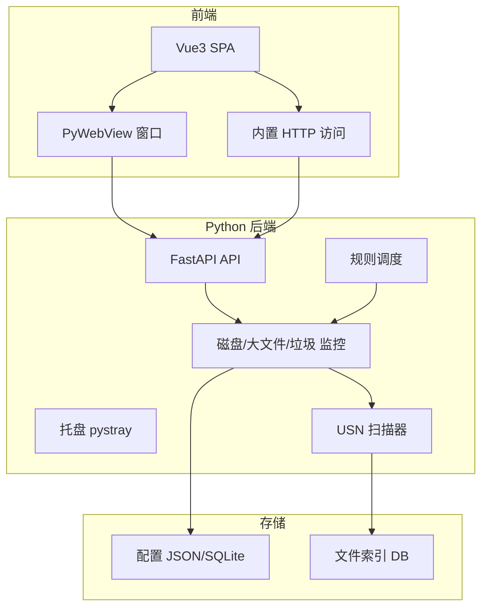

# Windows Cleaner 开发过程与迭代说明

本文档面向开发者与 AI 二次迭代，汇总项目架构、技术决策与迭代历程，便于快速加载上下文。

---

## 一、项目概述

- **一句话**：Windows 下轻量级磁盘监控与文件清理工具；支持 NTFS USN Journal 快速扫描、大文件与垃圾目录监控、清理规则与阈值提醒；提供 GUI、内置网页与外置 REST API。
- **技术栈**：
  - **后端**：Python 3.10+，FastAPI，pystray，PyWebView，pywin32，APScheduler，desktop-notifier，psutil
  - **前端**：Vue 3，Vue Router，Pinia，Axios，Vite
  - **打包**：PyInstaller；GitHub Actions 推送 tag 自动构建 Release

---

## 二、架构与目录

- **目录**：`backend/`（api、core、services、utils、tests）、`frontend/`（Vue SPA）、`packaging/`、`scripts/`、`docs/`。
- **入口**：`run.py`（PyInstaller 入口）、`backend/main.py`（FastAPI + 托盘 + 可选 PyWebView）。

---

## 三、关键实现要点

- **快速扫描**：NTFS USN Journal（pywin32）增量 + 全量兜底；索引 SQLite；低优先级线程与限流。
- **清理模式**：磁盘阈值提醒、按路径规则（大文件/扩展名/垃圾目录）、仅提醒或自动清理；规则存配置，定时任务调度。
- **轻量化**：单进程；资源自监控（`backend/services/resource_guard.py`）；bootstrap 日志在 `run.py` 最早写入，便于“无法打开/无托盘”时排查。

---

## 四、迭代历程摘要

1. **从零实现**：按计划搭建后端（FastAPI、磁盘/规则/垃圾监控）、前端（Vue 3）、托盘与 PyWebView、打包与 GitHub 发布。
2. **启动与错误可见性修复**：在 `run.py` 最早处写 bootstrap 日志；主线程与服务器线程、托盘异常统一写入日志；支持 `packaging/build_exe.py --console` 生成带控制台 exe，便于复现“无法打开、无托盘”问题。详见 `.cursor/plans/启动与错误可见性修复_d5924531.plan.md`。

---

## 五、入口、测试、打包、日志（速查）

| 用途 | 命令或路径 |
|------|------------|
| 仅 API | `python run.py --no-tray` 或 `python -m backend.main` |
| 托盘 + 窗口 | `python run.py --gui` 或 `python -m backend.main --gui` |
| 测试 | `pytest backend/tests/ -v` |
| 打包 | `python packaging/build_exe.py`；zip：`--zip`；调试 exe：`--console` |
| 配置/日志目录 | `%APPDATA%\WindowsCleaner` |
| 日志文件 | `%APPDATA%\WindowsCleaner\logs\windows_cleaner.log` |
| 版本号 | `backend/core/constants.py` 中 `APP_VERSION` |

调试顺序与规则配置步骤见 [docs/DEBUGGING.md](DEBUGGING.md)；打包与发布见 [packaging/README_PACK.md](../packaging/README_PACK.md)。
